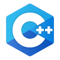

## Not a Developer or a Designer, I'm both!!

⚡ I'm **Rejwan Islam Rizvy**, a passionate full stack web developer and professional graphic designer with a keen eye for creating intuitive and visually appealing web applications. I leverage my expertise in Node.JS to craft fast and scalable web services.

### Languages and Tools:

### Expertise:
* Responsive Website Design
* React JS, Next JS
* JavaScript, Jquery
* HTML, CSS, Bootstrap
* MongoDB, ElasticSearch, SQL
* C/C++ (Problem Solving, Instructing)
* Python (In competitive Programming)
* In graphics, Figma, Adobe Illustrator, and Adobe Photoshop

### Connect with me:

 

